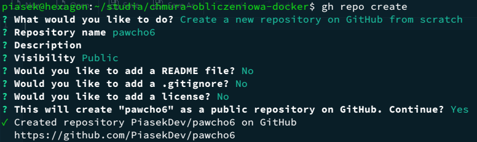
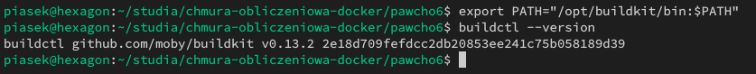
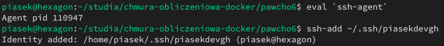
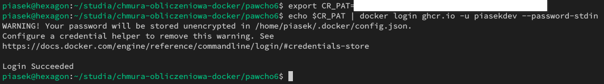
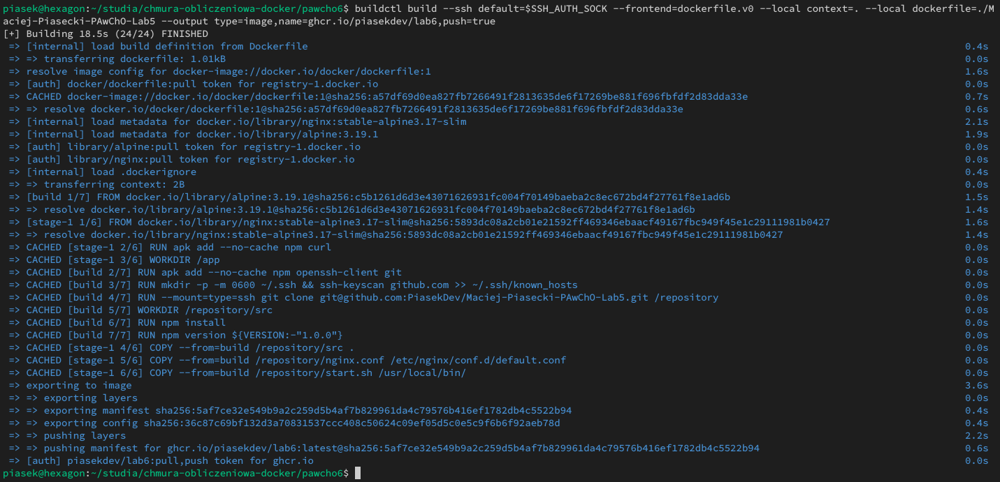
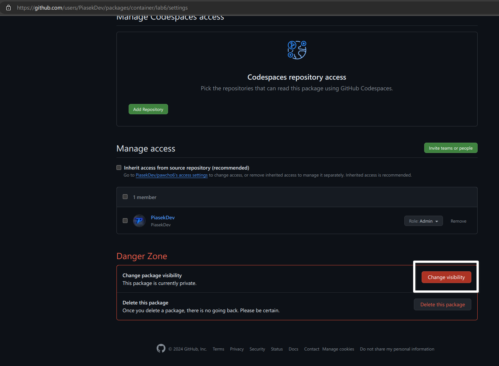
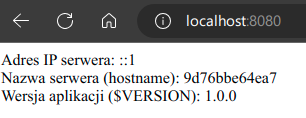

# Sprawozdanie z laboratorium Nr 6 Programowania aplikacji w chmurze obliczeniowej

## Autor sprawozdania: Maciej Krzysztof Piasecki (97701)

### Utworzenie repozytorium za pomocą gh cli

W celu utworzenia repozytorium wykonałem polecenie `gh repo create` i wybrałem opcje widoczne na zdjęciu poniżej.



Następnie wewnątrz katalogu utworzonego repozytorium, sklonowałem repozytorium zawierające sprawozdanie z laboratorium 5. Dodałem je również jako moduł do utworzonego repozytorium. Użyłem w tym celu następujących poleceń.

```shell
git clone git@github.com:PiasekDev/Maciej-Piasecki-PAwChO-Lab5.git
git submodule add git@github.com:PiasekDev/Maciej-Piasecki-PAwChO-Lab5.git Maciej-Piasecki-PAwChO-Lab5
```

Następnie informację o module dodałem do index'u git'a (git add + git commit) i umieściłem zmiany na github.  
Jako dodatkowy krok ustawiłem branch modułu, tak aby wskazywał on na branch lab6-changes w repozytorium `Maciej-Piasecki-PAwChO-Lab5`, który zawiera zaktualizowany plik Dockerfile. W tym celu wykonałem polecenie poniżej.

```shell
git submodule set-branch -b lab6-changes Maciej-Piasecki-PAwChO-Lab5
```

### Modyfikacja pliku Dockerfile

Zmodyfikowany plik Dockerfile jest dostępny w podrepozytorium `Maciej-Piasecki-PAwChO-Lab5`. Jego zaktualizowana wersja znajduje się na branchu lab6-changes. Zmiany wykonane w celu umożliwienia pełnienia roli frontendu oraz pobrania zawartości przygotowanego repozytorium poprzez SSH widoczne są w commicie `0593eccb69d31fd0fcd98d79f838ad5aefc90eaf (Update Dockerfile to clone repository using SSH)`.  
Z kolei modyfikacje wykonane w celu dodania połączenia obrazu z repozytorium pawcho6, są widoczne w commicie `04005e7a76953f0882b69438ccf4a2f4fd740c8b (Add a label to link container image to pawcho6 repo)`. Oba commity umieszczone zostały w repozytorium `Maciej-Piasecki-PAwChO-Lab5` (branch lab6-changes).

### Przygotowanie Buildkit

Aby przygotować (uruchomić) kontener Buildkit, który następnie wykorzystam w celu zbudowania obrazu wykonałem następujące polecenie.

```shell
docker run -d --name buildkitd --privileged moby/buildkit:v0.13.2
```

Wyeksportowałem również zmienną BUILDKIT_HOST, podającą adres daemon'a BuildKit, który zostanie użyty do budowy obrazu.

```shell
export BUILDKIT_HOST=docker-container://buildkitd
```

Ponadto, w celu uzystania dostępu do programu buildctl, z repozytorium Github [Buildkit](https://github.com/moby/buildkit) pobrałem również skompilowane pliki binarne, rozpakowałem je i dodałem katalog z nimi do swojej zmiennej PATH. Jak widać na zdjęciu poniżej po wykonaniu tego kroku uzyskałem dostęp do programu buildctl.



### Uruchomienie ssh-agent

Aby umożliwić pobranie repozytorium podczas procesu budowania obrazu, uruchomiłem ssh-agent i dodałem do niego swój klucz prywatny. W tym celu wykonałem polecenia widoczne na zdjęciu poniżej.



### Logowanie do ghcr.io

W celu umożliwienia przesłania zbudowanego obrazu do repozytorium ghcr, utworzyłem nowy token (klasyczny) z uprawnieniem write:packages. Zrobiłem to przechodząc na adres zaproponowany przez github (`https://github.com/settings/tokens/new?scopes=write:packages`), który pozwolił na utworzenie tokena z uprawnieniem write:packages, ale bez uprawnień z zakresu repo. Po stworzeniu nowego tokena, zalogowałem się nim do repozytorium za pomocą poleceń widocznych na zajęciu poniżej.



### Zbudowanie obrazu

Ostatecznie przystąpiłem do zbudowania obrazu. W tym celu przygotowałem polecenie podane poniżej.

```shell
buildctl build --ssh default=$SSH_AUTH_SOCK --frontend=dockerfile.v0 --local context=. --local dockerfile=./Maciej-Piasecki-PAwChO-Lab5 --output type=image,name=ghcr.io/piasekdev/lab6,push=true
```

Na poniższym zdjęciu widać natomiast efekt jego wykonania.



### Zmiana widoczności obrazu na Github

Po upewnieniu się, że zmiana widoczności przesłanego obrazu nie jest możliwa poprzez github cli (Źródła: [Is there a way to change package visibility via gh #6003](https://github.com/cli/cli/discussions/6003) oraz [Feature: Change package visibility using cli #6820](https://github.com/cli/cli/issues/6820)), przystąpiłem do zmiany widoczności przesłanego obrazu poprzez interfejs web. W tym celu w ustawieniach obrazu (Package settings) wybrałem opcję Change visibility i ustawiłem ją na public (publiczna). Okno zmiany widoczności przedstawiłem na zdjęciu poniżej.



### Weryfikacja poprawności działania obrazu

W celu weryfikacji poprawności działania obrazu, pobrałem go i uruchomiłem na jego podstawie kontener za pomocą poniższego polecenia.

```shell
docker run -p 8080:80 ghcr.io/piasekdev/lab6
```

Jak widać na zdjęciu poniżej, kontener działa poprawnie i odpowiada wymaganymi danymi, co świadczy o poprawnym wykonaniu zadania.


